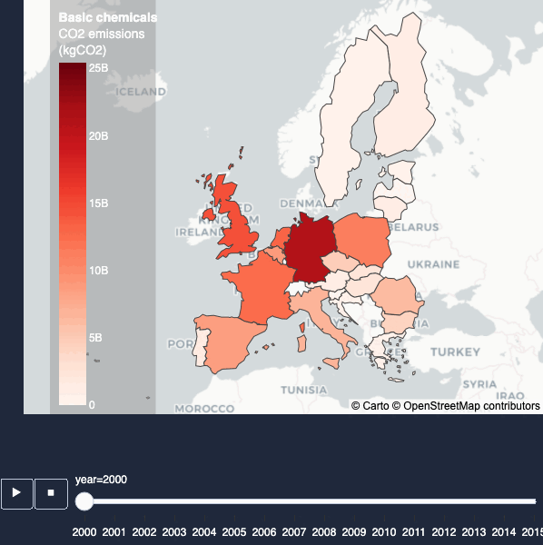
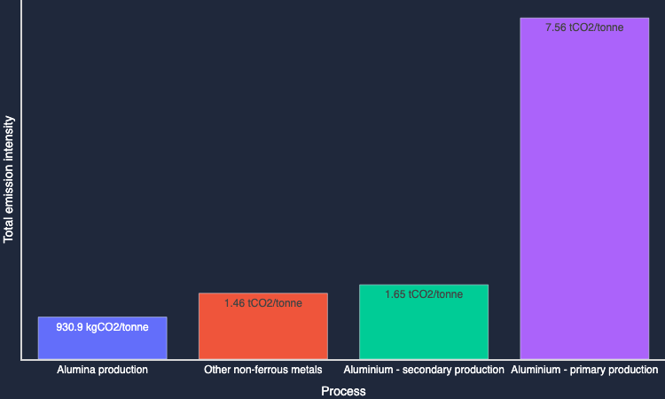

# EUR-energy

[](https://badrbmb-eur-energy-eur-energyvisualisation-home-elgwnx.streamlit.app/)

Explore the energy consumption of European industrial processes.

##  Description

Streamlit web app. to visualise the data behind the [JRC-IDEES: Integrated Database of the European Energy Sector](https://jeodpp.jrc.ec.europa.eu/ftp/jrc-opendata/JRC-IDEES/JRC-IDEES-2015_v1/2017%20JRC-IDEES%20Integrated%20Database%20of%20the%20European%20Energy%20Sector%20Methodological%20note.pdf).

- Explore the dynamics of energy demand from the European industry
  - From historical national data on physical outputs, to fuel consumption and emissions intensities, dive into the specifics of major European industrial sectors covering iron & steel, non-metallic mineral products, non-ferrous metals, pulp & paper, and the chemical industry.
  

  

_Total emissions from the `Basic chemicals` industry in EU27 + UK, 2000-2015._

- Derive insights from granular data on industrial sectors
  - Assess emission intensities and demand by fuel for each process within the major industrial sectors.
  

  

  _Emission intensities broken-down by process from the `Non ferrous metals` industry in EU27 + UK, 2015._


- Evaluate alternative scenarios for fuel demand
  - Simulate alternative fuel demand options for major industrial sectors and analyse the associated impacts on emissions.
```
Coming soon!
```

## Attributions

This app leverages files from multiple sources: 
    
  - [The JRC Integrated Database of the European Energy System](https://publications.jrc.ec.europa.eu/repository/handle/JRC112474), published by the European Commission
  - [Yearly electricity data](https://ember-climate.org/data-catalogue/yearly-electricity-data/), published by EMBER
  - [The Nomenclature of territorial units for statistics](https://ec.europa.eu/eurostat/web/gisco/geodata/reference-data/administrative-units-statistical-units/nuts), published by eurostat
  - [Greenhouse Gas Emissions from Energy](https://iea.blob.core.windows.net/assets/78ca213f-171e-40ed-bf7e-c053d4376e79/WORLD_GHG_Documentation.pdf), published by the IEA
  - favicon by [icon8](https://icons8.com/)
  - lottie animation by [Y. Pauranik](https://lottiefiles.com/85893-stack-blue-cs)